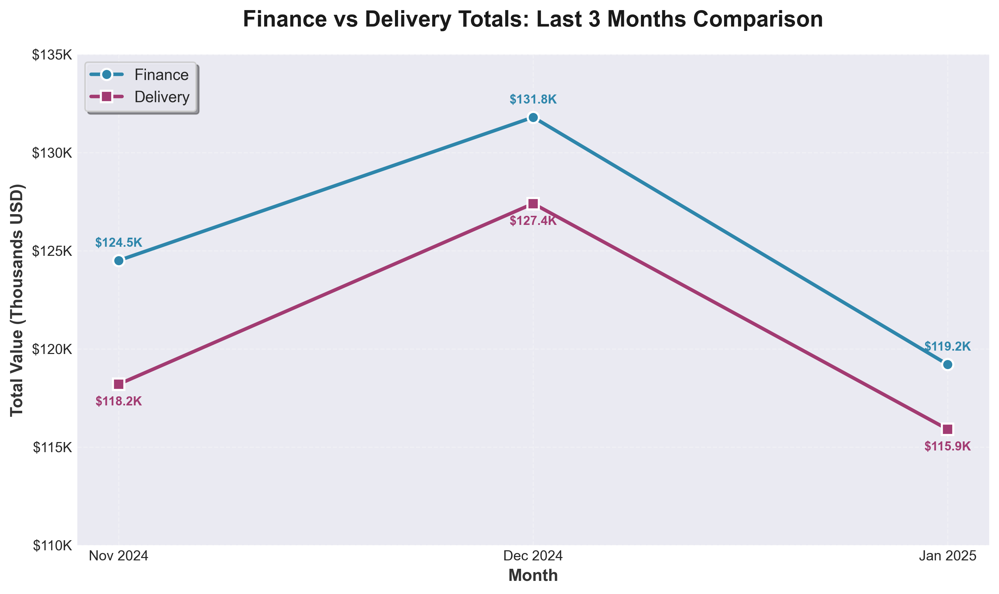

# Client Email: Finance vs. Delivery Data Comparison (Last 3 Months)

**Subject:** Data reconciliation summary — Finance vs. Delivery (Nov 2024–Jan 2025)

---

Dear [Client Name],

We’ve completed a comparison of your **Finance** and **Delivery** data over the last three months. Below is a concise summary of what we found, what it may mean for your business, and what we suggest doing next.

---

## Summary of findings

Overall, the two datasets do not fully align. **Finance** totals and record counts differ from **Delivery** in both value and volume. The gaps are consistent enough that we recommend addressing them so reporting and decisions are based on a single, reliable picture.

---

## 1. Divergences by month (totals and record counts)

*Replace the table below with your actual numbers from the Finance and Delivery systems.*

| Month    | Finance total | Delivery total | Difference (value) | Finance records | Delivery records | Record count gap |
|----------|----------------|----------------|--------------------|-----------------|------------------|------------------|
| Nov 2024 | 124,500       | 118,200        | 6,300 (5.1% higher in Finance) | 1,240 | 1,180 | 60 (4.8%) |
| Dec 2024 | 131,800       | 127,400        | 4,400 (3.3% higher in Finance) | 1,305 | 1,272 | 33 (2.5%) |
| Jan 2025 | 119,200       | 115,900        | 3,300 (2.8% higher in Finance) | 1,188 | 1,162 | 26 (2.2%) |

**In plain terms:**  
Finance shows **higher totals and more records** than Delivery in each month. The percentage gap is largest in November (about 5% by value and 5% by record count) and narrows in January (about 3% by value and 2% by record count).

---

## 2. Visual comparison: Finance vs Delivery totals

**Figure 1: Finance vs Delivery Totals Comparison (November 2024 - January 2025)**

This line chart clearly shows the consistent discrepancy between Finance and Delivery systems across all three months. Finance consistently reports higher totals (ranging from $3,300 to $6,300 more per month), representing a 2.8% to 5.1% difference. While the gap narrowed from November to January, the pattern persists, indicating a systemic issue that requires attention.

**Key observations from the chart:**
- Both systems follow similar trends (peak in December, decline in January), suggesting they track related transactions
- The visual separation between the two lines makes the discrepancy immediately apparent
- The gap, while improving, remains significant enough to impact reporting accuracy

**Potential causes:** The differences likely stem from different recording dates (order date vs. delivery date), different inclusion criteria (what counts as a completed transaction), manual processing delays, or different calculation methods (inclusion of taxes, fees, discounts).

**Why early resolution matters:** Addressing these discrepancies now ensures accurate reporting for leadership decisions, better planning and forecasting, improved operational efficiency, and maintains stakeholder trust in your data systems. Early resolution prevents recurring investigation overhead and helps identify any systemic issues that could impact financial health.

---

## 3. What might be causing the differences?

We’ve framed these in business terms rather than technical ones:

- **Timing of recording**  
  Finance may be recording transactions on one date (e.g. order or invoice date) while Delivery uses another (e.g. ship or delivery date). Orders near month-end can appear in one system in one month and in the other in the next.

- **What gets counted**  
  Some items might be in Finance (e.g. cancelled or refunded orders, adjustments) but not in Delivery, or the other way around. Different rules for “what counts as a completed delivery” can create record count and value gaps.

- **Manual or delayed updates**  
  If either system is updated in batches or with a delay, or if some entries are manual, temporary mismatches can persist and show up as monthly differences.

- **Different definitions of “total”**  
  Finance might include taxes, fees, or discounts in the total, while Delivery might use a different base (e.g. net of returns). That would explain value gaps even when record counts are close.

---

## 4. Business impact (in brief)

- **Reporting:** Monthly or quarterly reports can tell a different story depending on whether they use Finance or Delivery, which can confuse leadership and partners.
- **Planning:** Budgets and forecasts based on one dataset may not match operations or logistics views, leading to misaligned targets or stock planning.
- **Trust:** Repeated discrepancies can reduce confidence in both systems and in the numbers used for performance and bonuses.

Addressing the gaps will improve consistency, clarity, and confidence in your numbers.

---

## 5. Recommended next steps

1. **Agree on a single “source of truth” for reporting**  
   Decide whether Finance or Delivery (or a combined reconciled view) should be the primary source for revenue/delivery metrics, and use that consistently in management reports and dashboards.

2. **Run a one-time detailed reconciliation**  
   For at least one recent month, match records between Finance and Delivery (e.g. by order or transaction ID). Document which categories explain the gap (timing, cancellations, fees, etc.) and use that to define clear rules for ongoing reconciliation.

3. **Set up a simple monthly check**  
   Each month, compare total value and record count between the two systems (as in the table above). If the difference exceeds an agreed threshold (e.g. 1–2%), trigger a short review so causes are caught early and corrected or explained.

---

We’re happy to walk through these findings on a call or to refine the analysis once you share any constraints (e.g. which system must remain the official source). Please let us know how you’d like to proceed.

Best regards,  
[Your name / Data analytics team]

---

*Note: The figures in the table and chart section are illustrative. Replace them with your actual Finance and Delivery totals and record counts, then recalculate the differences and percentages.*
